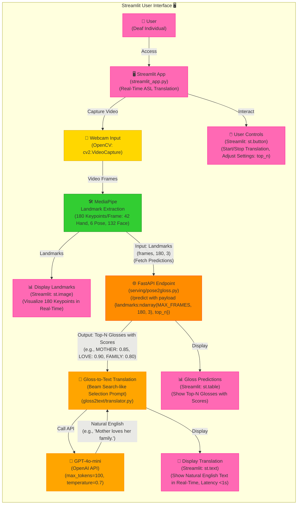

# Word-level & Pose-based Sign Language Interpreter

I am passionate about "AI for Good" projects, and I have conceived an idea to develop an AI system that translates sign language. I aim to create a solution that is not only technically impressive but also genuinely beneficial for the community. My vision is to go beyond merely recognizing individual letters (fingerspelling) and instead provide live captions for sign language without requiring specialized hardware like gloves or glasses.

## I. Proposed solution

Our input will be a video of deaf individuals using sign language and the output will be the corresponding English text. The solution pipeline is structured as follows:

**1. Pose-to-Gloss**:

-   I utilized [MediaPipe](https://ai.google.dev/edge/mediapipe/solutions/guide) to extract facial and hand landmarks from each frame. These coordinates will be formatted correctly and fed into a **Transformer** model. The goal is to classify the isolated signs or glosses represented by these coordinates. This approach has several advantages:

    -   By using key points instead of raw video data, we can streamline processing. We only need to analyze a small set of coordinates (3 for each point) per frame, significantly improving efficiency for real-time applications. Additionally, key points are less affected by varying backgrounds, hand sizes, skin tones, and other factors that complicate traditional image classification models.
    -   A sequence model will allow us to learn both temporal and spatial information (hand movements) from sequences of key points across frames, rather than classifying each frame in isolation, which can prolong prediction times.

-   I intend to collect and preprocess the [WLASL](https://arxiv.org/pdf/1910.11006v2) dataset to train our **Pose-to-Gloss** model. Although this dataset contains around **2000 classes**, it is limited to about **5-6 examples per word**, which is very sparse. Therefore, I adapted the [best solution](https://www.kaggle.com/competitions/asl-signs/discussion/406684) from the [Google - Isolated Sign Language Recognition competition](https://www.kaggle.com/competitions/asl-signs) on **Kaggle**, which utilizes a **Conv1D-Transformer** model.

**2. Gloss-to-Text**: This step involves translating the sequence of glosses into coherent, readable English text. As this is primarily a translation task, I simply employed prompt engineering with [OpenAI's GPT-4o mini](https://openai.com/index/gpt-4o-mini-advancing-cost-efficient-intelligence/) to convert our classifier's gloss outputs into their appropriate translations without any additional fine-tuning.

## II. Product High-level Design

The system is structured as a pipeline with distinct subsystems: [**Data Sources**](#1-data-sources-), [**Feature Store**](#2-feature-store-️), [**MLOps Pipeline**](#3-mlops-pipeline-clearml-), [**Model Serving**](#4-model-serving-), [**Gloss-to-Text Translation**](#5-gloss-to-text-translation-), [**CI/CD Pipeline**](#6-cicd-pipeline-), and [**User Interface**](#7-user-interface-️). Each subsystem is meticulously designed to handle specific aspects of the **ASL** translation workflow, from raw video data to a user-facing [Streamlit](https://streamlit.io/) app that provides real-time translations. The design integrates [ClearML](https://clear.ml/) for MLOps automation, **GitHub Actions** for CI/CD, [FastAPI](https://fastapi.tiangolo.com/) for model serving, and [GPT-4o mini](https://openai.com/index/gpt-4o-mini-advancing-cost-efficient-intelligence/) for natural language translation, culminating in a production-ready solution.

👉 Check the [docs](./docs/) folders for more information about the implementation.

```mermaid
graph TD
    %% Data Sources
    subgraph "Data Sources 🌐"
        A1["📹 WLASL Videos<br>(Kaggle: risangbaskoro/wlasl-processed<br>sttaseen/wlasl2000-resized)"] -->|Download| A2["📂 Raw Data Storage<br>(datasets/wlasl-processed.zip)<br>(datasets/wlasl2000-resized.zip)"]
        A2 -->|Upload to ClearML| A3["📦 ClearML Dataset<br>(WLASL2000)"]
    end

    %% Feature Store
    subgraph "Feature Store 🗄️"
        A3 -->|Input Videos| B1["🛠️ MediaPipe<br>Landmark Extraction Task<br>(preprocessing/wlasl2landmarks.py)<br>(180 Keypoints/Frame: 42 Hand, 6 Pose, 132 Face)"]
        B1 -->|Takes ~2 days| B2["📦 ClearML Dataset<br>(WLASL_landmarks.npz & WLASL_parsed_metadata.json)<br>Tags: stable"]
        B2 -->|Store Features| B3["📊 Feature Store<br>(Landmarks Features + Metadata: video_id, gloss, split)"]
    end

    %% MLOps Pipeline
    subgraph "MLOps Pipeline (ClearML) 🚀"
        %% Data Preparation
        subgraph "Data Preparation 🔄"
            B3 -->|Load Features| C1["⚙️ Data Splitting<br>(step1_data_splitting.py)<br>(Splits: Train, Val, Test)"]
            C1 -->|Log Statistics| C2["📊 Feature Stats<br>(Num Frames/Video,<br>Video Count)<br>ClearML PLOTS"]
            C1 -->|"Output: ClearML Artifacts<br>(X_train, y_train)"| C3["⚙️ Data Augmentation<br>(Rotate, Zoom, Shift, Speedup, etc.)<br>(step2_data_augmentation.py)"]
            C3 -->|"Output: ClearML Artifacts<br>(X_train, y_train)"| C4["⚙️ Data Transformation<br>(Normalize: Nose-based<br>Pad: max_frames=195, padding_value=-100.0)<br>(step3_data_transformation.py)"]
            C1 -->|"Output: ClearML Artifacts<br>(X_val, y_val, X_test, y_test)"| C4
        end

        %% Multi-Model Training and Selection
        subgraph "Multi-Training & Selection 🧠"
            C4 -->|"Input: ClearML Artifacts<br>(X_train, y_train, X_val, y_val)"| D1["🧠 Pose-to-Gloss Models<br>1. GISLR (dim=192, kernel_size=17, dropout=0.2)<br>2. ConvNeXtTiny (include_preprocessing=False, include_top=True)<br>Prepare TF Dataset<br>(model_utils.py)"]
            D1 -->|"Mixed Precision<br>Parallel Training<br>(2 Colab A100 GPUs)"| D2["📈 Model Training<br>(step4_model_training.py)<br>(Batch Size: 128, Epochs: 100, learning_rate=1e-3, AdamW, ReductOnPlateau)"]
            D2 -->|Log Metrics| D3["📉 Training Metrics<br>(Loss, Accuracy, Top-5)<br>ClearML SCALARS"]
            D2 -->|Compare val_accuracy| D4["📋 Model Selection Task<br>(step5_model_selection.py)<br>(Select GISLR: Top-1 Accuracy 60%)"]
        end

        %% Hyperparameter Tuning
        subgraph "Hyperparameter Tuning 🔍"
            D4 -->|Best Model| E1["🔍 HyperParameterOptimizer<br>(step6_hyperparameter_tuning.py)<br>Search Space: learning_rate, dropout_rate, dim<br>Multi-objective (OptimizerOptuna): minimize val_loss & maximize val_accuracy<br>concurrent_tasks=2, total_max_jobs=2"]
            E1 -->|Best Parameters| E2["📊 Upload artifact<br>(best_job_id, best_hyperparameters, best_metrics)"]
            E1 -->|Log Metrics| E3["📉 Updated Metrics<br>(val_accuracy: ~60%, val_top5_accuracy: ~87%)"]
        end

        %% Evaluation
        subgraph "Evaluation 📊"
            C4 -->|Test Set: X_test, y_test| F1["📊 Model Evaluation<br>(step7_model_evaluation.py)<br>"]
            E2 -->|Best Job ID, Best Weights| F1
            F1 -->|Log Metrics| F2["📉 Evaluation Metrics<br>- Accuracy, Top-5<br>- Classification Report)<br>- Confusion Matrix<br>- ClearML PLOTS"]
        end

        %% Continuous Training
        subgraph "Continuous Training 🔄"
            G1["🔔 TriggerScheduler: New Data<br>(Monitor Tags: ['landmarks', 'stable'])<br>(trigger.py)"]
            G1 -->|Rerun Pipeline| H1
            B2 --> G1
            G2["🔔 TriggerScheduler: Performance Drop<br>(Monitor Test Accuracy < 60%)<br>(trigger.py)"]
            G2 -->|Rerun Pipeline| H1
            F2 --> G2
            H1["🔄 PipelineController<br>(pipeline_from_tasks.py)<br>(Parameters: max_labels=100/300, batch_size=128, max_frames=195)<br>Tags: production"]
            H1 -->|Step 1| C1
            H1 -->|Step 2| C3
            H1 -->|Step 3| C4
            H1 -->|Step 4| D2
            H1 -->|Step 5| D4
            H1 -->|Step 6| E1
            H1 -->|Step 7| F1
            H1 -->|Tag Management| H2["🏷️ Production Tag<br>(Best Pipeline Selected)"]
        end
    end

    %% Model Serving
    subgraph "Model Serving 🌐"
        F1 -->|"Deploy Best Model<br>(TFLite Conversion)"| I1["🌐 FastAPI Endpoint<br>(serving/pose2gloss.py)<br>(Endpoints: /predict, /health, /metadata)<br>(Pydantic: Top-N Glosses with Scores)"]
    end

    %% Gloss-to-Text Translation
    subgraph "Gloss-to-Text Translation 📝"
        I1 -->|Top-5 Glosses with Scores| J1["📝 Gloss-to-Text Translation<br>(Beam Search-like Prompt)<br>(gloss2text/translator.py)"]
        J1 -->|Call API| J2["🧠 GPT-4o-mini<br>(OpenAI API)<br>(max_tokens=100, temperature=0.7)"]
        J2 -->|Natural English| J1
        J1 -->|Log Metrics| J3["📊 Translation Metrics<br>(BLEU, ROUGE Scores)<br>ClearML PLOTS"]
    end

    %% CI/CD Pipeline
    subgraph "CI/CD Pipeline (GitHub Actions) 🚀"
        K1["📂 GitHub Repository<br>(SyntaxSquad)"]
        K1 -->|Push/PR| K2["🚀 GitHub Actions<br>(.github/workflows/pipeline.yml)"]
        K2 -->|CI: Test| K3["🛠️ Test Remote Runnable<br>(cicd/example_task.py)"]
        K3 -->|CI: Execute| K4["🔄 Execute Pipeline<br>(cicd/pipeline_from_tasks.py)"]
        K4 -->|CI: Report| K5["📊 Report Metrics<br>(cicd/pipeline_reports.py)<br>(Comments on PR)"]
        K4 -->|CD: Tag| K6["🏷️ Production Tagging<br>(cicd/production_tagging.py)"]
        K6 -->|CD: Deploy| K7["🌍 Deploy FastAPI<br>(cicd/deploy_fastapi.py)<br>(Localhost Simulation)"]
        K7 --> I1
    end

    %% User Interface
    subgraph "User Interface 🖥️"
        L1["🎥 Webcam Input<br>(apps/streamlit_app.py)"]
        L1 -->|Extract Landmarks| B1
        L1 -->|Fetch Predictions| I1
        L1 -->|Display Translation| J1
        L1 -->|Render UI| L2["🖥️ Streamlit UI<br>(Real-Time Translation Display)"]
    end

    %% Styling for Color and Beauty
    style A1 fill:#FFD700,stroke:#DAA520
    style A2 fill:#FFD700,stroke:#DAA520
    style A3 fill:#FFD700,stroke:#DAA520
    style B1 fill:#32CD32,stroke:#228B22
    style B2 fill:#32CD32,stroke:#228B22
    style B3 fill:#32CD32,stroke:#228B22
    style C1 fill:#FF69B4,stroke:#FF1493
    style C2 fill:#FF69B4,stroke:#FF1493
    style C3 fill:#FF69B4,stroke:#FF1493
    style C4 fill:#FF69B4,stroke:#FF1493
    style D1 fill:#FF8C00,stroke:#FF4500
    style D2 fill:#FF8C00,stroke:#FF4500
    style D3 fill:#FF8C00,stroke:#FF4500
    style E1 fill:#00CED1,stroke:#008B8B
    style E2 fill:#00CED1,stroke:#008B8B
    style E3 fill:#00CED1,stroke:#008B8B
    style F1 fill:#1E90FF,stroke:#4682B4
    style F2 fill:#1E90FF,stroke:#4682B4
    style G1 fill:#ADFF2F,stroke:#7FFF00
    style G2 fill:#ADFF2F,stroke:#7FFF00
    style H1 fill:#FF6347,stroke:#FF4500
    style H2 fill:#FF6347,stroke:#FF4500
    style I1 fill:#FF1493,stroke:#C71585
    style J1 fill:#FFA500,stroke:#FF8C00
    style J2 fill:#FFA500,stroke:#FF8C00
    style J3 fill:#FFA500,stroke:#FF8C00
    style K1 fill:#DA70D6,stroke:#BA55D3
    style K2 fill:#DA70D6,stroke:#BA55D3
    style K3 fill:#DA70D6,stroke:#BA55D3
    style K4 fill:#DA70D6,stroke:#BA55D3
    style K5 fill:#DA70D6,stroke:#BA55D3
    style K6 fill:#DA70D6,stroke:#BA55D3
    style K7 fill:#DA70D6,stroke:#BA55D3
    style L1 fill:#FFDAB9,stroke:#FF7F50
    style L2 fill:#FFDAB9,stroke:#FF7F50
```

### 1. Data Sources 🌐

This subsystem handles the ingestion of raw data, specifically ASL videos from the WLASL dataset, sourced from Kaggle (`risangbaskoro/wlasl-processed` and `sttaseen/wlasl2000-resized`). The videos are downloaded as ZIP files (`datasets/wlasl-processed.zip`, `datasets/wlasl2000-resized.zip`) and uploaded to [ClearML](https://clear.ml/) as a dataset (`WLASL2000`).

-   **Data Sourcing Strategy**: I used 2 Kaggle datasets to ensure robustness against missing videos, a challenge I identified in [Sprint 1](./docs/sprint1.md).
-   **ClearML Dataset**: Storing the raw data in [ClearML](https://clear.ml/) (`WLASL2000`) facilitates versioning and traceability, key for [MLOps Level 2](https://docs.cloud.google.com/architecture/mlops-continuous-delivery-and-automation-pipelines-in-machine-learning#mlops_level_2_cicd_pipeline_automation). [ClearML's dataset](https://clear.ml/docs/latest/docs/datasets) management allows tagging and monitoring, which supports continuous training [triggers](https://clear.ml/docs/latest/docs/getting_started/task_trigger_schedule/) later in the pipeline.

### 2. Feature Store 🗄️

This subsystem extracts landmarks from videos using [MediaPipe](https://ai.google.dev/edge/mediapipe/solutions/guide), stores them as features, and registers them in [ClearML](https://clear.ml/). The process starts with the `WLASL2000` dataset, extracts `180` keypoints per frame (`42` hand, `6` pose, `132` face) using [wlasl2landmarks.py](./preprocessing/wlasl2landmarks.py), and saves the results as `WLASL_landmarks.npz` and [WLASL_parsed_metadata.json](./datasets/WLASL_parsed_metadata.json). These are tagged as `stable` in [ClearML](https://clear.ml/) and stored in a feature store with metadata (`video_id`, `gloss`, `split`).

This **Landmark Extraction** process takes **~2** days due to the scale of the dataset (**~21k** videos), but [ClearML's task](https://clear.ml/docs/latest/docs/fundamentals/task/) management ensures this is a one-time cost with reusable outputs. The feature store's integration with [ClearML](https://clear.ml/) allows for versioning and reproducibility, critical for iterative development.

### 3. MLOps Pipeline ([ClearML](https://clear.ml/)) 🚀

This is the core of the system, which orchestrates data preparation, training, evaluation, and continuous training, following [Google's MLOps guidelines](https://docs.cloud.google.com/architecture/mlops-continuous-delivery-and-automation-pipelines-in-machine-learning). Let's break down its subcomponents.

-   **Data Preparation** 🔄: Features from the feature store are processed through 3 tasks: **Data Splitting**, **Data Augmentation**, and **Data Transformation**. The splitting task ([step1_data_splitting.py](./pose2gloss/step1_data_splitting.py)) divides data into train, validation, and test sets, logging statistics (e.g., number of frames, video count) as [ClearML plots](https://clear.ml/docs/latest/docs/guides/reporting/scatter_hist_confusion_mat_reporting/). Augmentation ([step2_data_augmentation.py](./pose2gloss/step2_data_augmentation.py)) applies `rotate`, `zoom`, `shift`, `speedup`, while transformation ([step3_data_transformation.py](./pose2gloss/step3_data_transformation.py)) normalizes landmarks (nose-based) and pads sequences to `max_frames=195` with `padding_value=-100.0`.

-   **Multi-Training & Selection** 🧠: This subsystem trains 2 **Pose-to-Gloss** models: [Conv1D-Transformer](https://www.kaggle.com/competitions/asl-signs/discussion/406684) from [GISLR](https://www.kaggle.com/competitions/asl-signs) (`dim=192`, `kernel_size=17`, `dropout=0.2`) and ConvNeXtTiny (`include_preprocessing=False`, `include_top=True`). Training ([step4_model_training.py](./pose2gloss/step4_model_training.py)) uses mixed precision on 2 Colab A100 GPUs, with `batch_size=128`, `epochs=100`, `learning_rate=1e-3`, AdamW optimizer, and `ReduceLROnPlateau`. Metrics (loss, accuracy, top-5) are logged as [ClearML scalars](https://clear.ml/docs/latest/docs/guides/reporting/scalar_reporting). Model selection (`step5_model_selection.py`) chooses GISLR's model based on validation accuracy (**`60%`** top-1), aligning with the original [WLASL](https://arxiv.org/pdf/1910.11006v2) (65.89% top-1 for **WLASL100**) paper.

-   **Hyperparameter Tuning** 🔍: The [HyperParameterOptimizer](https://clear.ml/docs/latest/docs/guides/optimization/hyper-parameter-optimization/examples_hyperparam_opt) in [step6_hyperparameter_tuning.py](./pose2gloss/step6_hyperparameter_tuning.py) tunes the GISLR model's hyperparameters (`learning_rate`, `dropout_rate`, `dim`) using [Optuna](https://optuna.org/), with a multi-objective goal (minimize `val_loss`, maximize `val_accuracy`). It runs 2 concurrent tasks with a total of 2 jobs, logging best parameters and metrics (`val_accuracy` **`~60%`**, `val_top5_accuracy` **`~87%`**) to [ClearML](https://clear.ml/).

-   **Evaluation** 📊: The evaluation task ([step7_model_evaluation.py](./pose2gloss/step7_model_evaluation.py)) assesses the best model (GISLR with tuned hyperparameters) on the test set, logging accuracy, top-5 accuracy, classification report, and confusion matrix as [ClearML plots](https://clear.ml/docs/latest/docs/guides/reporting/scatter_hist_confusion_mat_reporting/).

-   **Continuous Training** 🔄: The [PipelineController](https://clear.ml/docs/latest/docs/guides/pipeline/pipeline_controller) in [pipeline_from_tasks.py](./pipeline_from_tasks.py) orchestrates the entire pipeline, with parameters customizable for experiments (`max_labels=100/300`, `batch_size=128`, `max_frames=195`) and a `production` tag to mark the pipeline for deployment. `TriggerScheduler` monitors for new data (via tags `landmarks`, `stable`) and performance drops (test accuracy < **`60%`**), rerunning the pipeline as needed.

### 4. Model Serving 🌐

The best model is converted to [TFLite](https://ai.google.dev/edge/litert) for efficient inference and deployed as a [FastAPI](https://fastapi.tiangolo.com/) endpoint ([serving/pose2gloss.py](./serving/pose2gloss.py)). Endpoints include `/predict` (returns top-N glosses with scores), `/health`, and `/metadata`, using [Pydantic](https://docs.pydantic.dev/latest/) for request/response validation:

-   **TFLite Conversion**: Converting the model to [TFLite](https://ai.google.dev/edge/litert) reduces inference latency and memory usage, critical for real-time applications like **ASL** translation. This optimization ensures the system can run on resource-constrained environments (e.g., local machines).
-   **FastAPI Endpoints**: The `/predict` endpoint leverages the top-N gloss prediction strategy (top-5 accuracy **`~87%`**), enhancing translation quality. `/health` and `/metadata` endpoints will provide operational insights, aligning with production best practices.

### 5. Gloss-to-Text Translation 📝

The **top-5** glosses with scores from the [FastAPI](https://fastapi.tiangolo.com/) endpoint are fed into the **Gloss-to-Text** task ([gloss2text/translator.py](./gloss2text/translator.py)). A beam search-like prompt is used with [GPT-4o mini](https://openai.com/index/gpt-4o-mini-advancing-cost-efficient-intelligence/) (`max_tokens=100`, `temperature=0.7`) to generate natural English translations.

Using **top-5** glosses with scores allows [GPT-4o mini](https://openai.com/index/gpt-4o-mini-advancing-cost-efficient-intelligence/) to select the most coherent combination, significantly improving translation quality over a **top-1** approach (given the **`61%`** **top-1** accuracy). This mimics **beam search** by considering multiple hypotheses.

### 6. CI/CD Pipeline (GitHub Actions) 🚀

This repository uses GitHub Actions ([.github/workflows/pipeline.yml](./.github/workflows/pipeline.yml)) for **CI/CD**:

-   **CI** includes testing ([cicd/example_task.py](./cicd/example_task.py)), [pipeline execution](./pipeline_from_tasks.py), and reporting metrics as PR comments ([cicd/pipeline_reports.py](./cicd/pipeline_reports.py))
-   **CD** tags the pipeline ([cicd/production_tagging.py](./cicd/production_tagging.py)) for production and [deploys](./serving/pose2gloss.py) the [FastAPI](https://fastapi.tiangolo.com/) endpoint to a localhost simulation.

### 7. User Interface 🖥️

The Streamlit UI ([streamlit_app.py](./apps/streamlit_app.py)) provides a real-time **ASL** translation interface. It captures webcam input, extracts landmarks using [MediaPipe](https://ai.google.dev/edge/mediapipe/solutions/guide), fetches **top-N** gloss predictions via the [FastAPI](https://fastapi.tiangolo.com/) endpoint, and displays translations from the [Gloss-to-Text](#5-gloss-to-text-translation-) task. The UI renders landmarks, gloss predictions, translations, and user controls.

## III. Future work

Initially, our project will concentrate on **American Sign Language**. In future iterations, I plan to incorporate multilingual capabilities along with the following features:

-   Converting the output from text to audio.
-   Managing multiple signers within a single frame.
-   Implementing temporal segmentation to identify which frames contain sign language, enhancing translation accuracy and speed by allowing us to disregard irrelevant video content during inference.
-   Developing an end-to-end model for direct **Pose-to-Text** or even **Pose-to-Audio**. However, I anticipate challenges in processing entire videos compared to a defined set of key points.
-   Utilizing multimodal inputs to improve translation accuracy:

    -   **Audio Context**: In mixed environments, incorporating audio from non-signers can provide context, helping to disambiguate signs based on spoken topics.

    -   **Visual Context**: Integrating object detection or scene analysis can enhance understanding (e.g., recognizing a kitchen setting to interpret relevant signs).

For the demonstration, I envision creating an extension for video conferencing platforms like Google Meet to generate live captions for deaf individuals. However, I recognize that this concept primarily aids non-signers in understanding deaf individuals rather than empowering deaf people to communicate effectively. My current time constraints prevent me from implementing a text-to-sign feature, so for now, I can only conceptualize this one-way communication demo, rather than a two-way interaction that facilitates communication from deaf individuals back to others.
