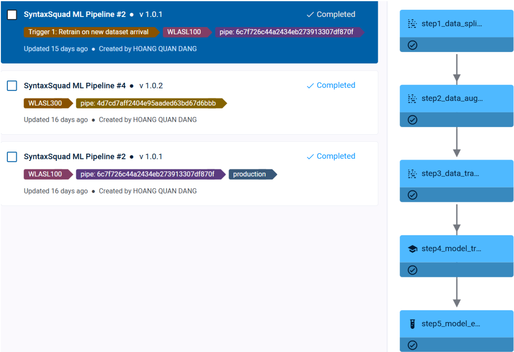

# Sprint 2: Develop, Test and Deploy MLOps ([MLOps Level 1](https://docs.cloud.google.com/architecture/mlops-continuous-delivery-and-automation-pipelines-in-machine-learning#mlops_level_1_ml_pipeline_automation))

Overall, for this [MLOps level 1](https://docs.cloud.google.com/architecture/mlops-continuous-delivery-and-automation-pipelines-in-machine-learning#mlops_level_1_ml_pipeline_automation) stage (Continuous training), new components are required to store the feature for training and inference, a [trigger](#trigger-scheduling) that notifies the potential model performance drops, and model/pipeline metadata management to store ML system details. We must modify existing codes in [Sprint 1](./sprint1.md) and break the project into [several tasks](../pose2gloss/) to [ClearML](https://clear.ml/) and use `PipelineController.add_step()` to [execute them](../pipeline_from_tasks.py):

-   Pipeline is a way to streamline and connect multiple processes, plugging the output of one process as the input of another.
-   Pipelines can be executed locally or on any machine using the [clearml-agent](https://clear.ml/docs/latest/docs/clearml_agent/).
-   We need to hold the ClearML [agent from Colab](../Agent.ipynb) for GPU utilization.
-   Later on, we will add UI/UX and CI/CD to it in [Sprint 3](./sprint3.md).

For the product MLOps, it is required to use [ClearML](https://clear.ml/) to:

-   [Break](../pose2gloss/) each component of data engineering, each component of training, and evaluation into many [ClearML tasks](https://clear.ml/docs/latest/docs/fundamentals/task/).
-   Chain the above tasks together and deploy an end-to-end ML pipeline of everything with model performance metrics (e.g., scalars, plots, confusion matrix, debug samples, etc.).
-   Perform [ML pipeline](../pipeline_from_tasks.py) automation for [Continuous Training](https://docs.cloud.google.com/architecture/mlops-continuous-delivery-and-automation-pipelines-in-machine-learning#mlops_level_1_ml_pipeline_automation).
-   The whole process should be run again whenever new data comes in.

> [!IMPORTANT]
> Also check my [YouTube Explanation](https://www.youtube.com/watch?v=8LgE1IvSncQ) and the [artifacts summary](sprint2.pdf) of this sprint for better insights and understanding.

## Environment Setup

Firstly, I had to initialize ClearML and configure the agent. I used [Colab as an agent](../Agent.ipynb) for GPU. For each task, when I finished the development, I will use `start_locally()` to test it on my machine first and then use `execute_remotely()` to turn it into **DRAFT** mode on ClearML, making it as a **template** that's waiting to be enqueued and executed on the remote agent (Colab). As usual, I will set up ClearML according to its documentation. However, as our repo is private, I had to do an extra step, which is to add [GitHub's access tokens](https://github.com/settings/personal-access-tokens) so that the agent can fully access the repo.

Before, when I learned about ClearML, I could successfully execute the example pipeline locally, but when I tried to execute it on an agent, it didn't work because it couldn't find the imported modules in the executed file. This is because the agent will create a completely new environment to execute only that file, so it doesn't know the related Python modules imported inside it. I knew why, but I didn't know how to fix this yet, and I thought the "agent" thing was so stupid. When adapting ClearML to this ASL project, I found the solution. ClearML will work best with git as it will clone the repo when initializing the new environment. Now, my code works like a charm.

Next, I started to store the [WLASL](https://arxiv.org/pdf/1910.11006v2) raw data as an initial feature store for the pipeline. This task is quite simple. I watched [ClearML's Onboarding videos on YouTube](https://www.youtube.com/playlist?list=PLMdIlCuMqSTnb8sOFLujZufc_XGKOHdHR) and found that I just need to use [ClearML Data CLI](https://clear.ml/docs/latest/docs/clearml_data/clearml_data_cli/) to add 2 related [WLASL](https://arxiv.org/pdf/1910.11006v2) dataset zip files to ClearML. Then, I need to automate the **Landmark Extraction** into a [ClearML task](https://clear.ml/docs/latest/docs/fundamentals/task/). In fact, this task should be put as a step in the pipeline. However, as demonstrated in the [last Sprint](./sprint1.md), this task takes an extremely long time to finish (2 days), so I named it [step 0](../preprocessing/wlasl2landmarks.py) and executed it individually for some iterations to demonstrate that my code works. I will use the final `WLASL_landmarks.npz` and the metadata files I obtained from [Sprint 1](./sprint1.md) as the outcome for this step. I uploaded them to ClearML using the [Data CLI](https://clear.ml/docs/latest/docs/clearml_data/clearml_data_cli/) and the raw data uploaded before as the parents.

## Data Preparation Automation

Now, it's time for **Data Preparation** Automation. Here, I just need to successfully execute [step 1](../pose2gloss/step1_data_splitting.py), then the other data engineering steps are pretty simple as they are mostly the same. The workflow would be landmarks data -> train/val/test data ([step 1](../pose2gloss/step1_data_splitting.py)) -> augment only the train data ([step 2](../pose2gloss/step2_data_augmentation.py)) -> perform padding/truncation and label encoding for all subsets ([step 3](../pose2gloss/step3_data_transformation.py)). For easy customization and chaining when including each step in the [PipelineController](https://clear.ml/docs/latest/docs/guides/pipeline/pipeline_controller), I will set up their own parameters and configure them so they can upload their outcomes as artifacts to ClearML.

Regarding [step 1](../pose2gloss/step1_data_splitting.py), I also added some reports and visualizations to demonstrate the splitting results, which can be viewed using the **PLOTS** tab of this step after executing the pipeline. Additionally, this [step 1](../pose2gloss/step1_data_splitting.py) was super slow when I tested it on my local machine, as it had to download nearly **10 GB** of data. Yes, **10 GB**; I thought it only downloaded the dataset with the ID I specified. However, it also downloaded all the previous versions (parents) of that data, which resulted in unnecessary, heavy, and duplicated files on my laptop. I think I will post an issue on ClearML about this non-optimal problem. I decided to use the agent (Colab) to execute this step, as Colab has a much faster internet connection, and I indeed obtained the results much faster than on my laptop.

## Model Training, Evaluation, and Pipeline Automation

After completing the **Data Preparation** Automation, I will automate the ML pipeline to train, evaluate, and deploy the **Pose-to-Gloss Model**:

-   This step will prepare [TF dataset](https://www.tensorflow.org/api_docs/python/tf/data/Dataset) with nose normalization for the train and val subsets from the data transformation, and train the model. Here, I perform real-time logging on ClearML for the training process using ClearML's `logger.report_scalar` as a callback during the fitting. The final model weights will be published to this ClearML task using [ClearML's OutputModel](https://clear.ml/docs/latest/docs/references/sdk/model_outputmodel/).
-   There are many conflicts in this step. First, when I use `execute_remotely()` to create this step as a **template** task for the pipeline, ClearML resolves the current environment on my laptop, which includes `tensorflow-intel`, so this will not work on the [Colab agent](../Agent.ipynb). This is not a big deal, as I can manually remove `tensorflow-inte`l in the **PYTHON PACKAGES** section of this task's **EXECUTION** tab.
-   The bigger problem happened when I tried to enqueue this task on the **agent**. ClearML will create a new environment inside the **agent** to execute this task as usual. However, this new environment has conflicts between the installed **tensorflow** and **nvidia-cudnn-cu12** packages. **TensorFlow 2.18.0** requires `nvidia-cudnn-cu12==9.3.0.75`, but ClearML installed the **9.2** version instead. It took me quite a long time to find out what happened

Next, I created a ClearML task to evaluate the **Pose-to-Gloss** model. This task will take the `train`/`val`/`test` subsets from the [data transformation step](../pose2gloss/step3_data_transformation.py) and the model obtained from the [model training task](../pose2gloss/step4_model_training.py) to perform the evaluations on each subset. Here, I exported 3 reports to ClearML: sklearn's `classification_report`, confusion matrix, and a summarized metrics table of subsets (loss, accuracy, top5 accuracy).

Now, it's time for the most important task, the [Continuous Training](https://docs.cloud.google.com/architecture/mlops-continuous-delivery-and-automation-pipelines-in-machine-learning#mlops_level_1_ml_pipeline_automation) pipeline for **Pose-to-Gloss**:

-   Using [PipelineController](https://clear.ml/docs/latest/docs/guides/pipeline/pipeline_controller), I chained each **template** task I created before to create an end-to-end ML pipeline. When executing the pipeline remotely on the **agent**, it didn't yield any errors, but it just got stuck there; no step in the pipeline was executed. Later, I found this [GitHub issue](https://github.com/clearml/clearml/issues/1328), and I knew why: We can not use the same queue for both the pipeline and its tasks when starting the pipeline remotely, as it will make the pipeline stuck, so just use a different name for the pipeline queue or use `start_locally()`. Therefore, I decided to `start_locally()` the pipeline on my laptop, but each of its steps will be executed inside the [Colab agent](../Agent.ipynb).
-   Here, I executed 2 [pipelines](../pipeline_from_tasks.py): one for **100** top glosses (**WLASL100**), one for **300** (**WLASL300**). I included each step's parameters into the pipeline's parameters so that I can configure each step in a global way through the pipeline. I just need to update some parameters of the **WLASL100** pipeline and start it again to obtain the **WLASL300** pipeline. When all the steps for each pipeline turn green to blue, I know I succeeded.

## Trigger Scheduling

After finishing the pipeline, I decided to take an extra step to further follow the [MLOps level 1](https://docs.cloud.google.com/architecture/mlops-continuous-delivery-and-automation-pipelines-in-machine-learning#mlops_level_1_ml_pipeline_automation), the **Trigger**. I developed 2 [Triggers](../trigger.py) here to rerun the whole pipeline by monitoring these 2 events: new dataset arrival or test accuracy below **`60%`**. An extremely useful thing I implemented here is tag management, which I learned from [ClearML's tutorial](https://www.youtube.com/watch?v=tVdBubrCK6Y). It's so useful that I decided to adapt it for the whole project, assigning each task with some tags that best describe it. By doing this, I can easily access the latest tasks or artifacts without knowing a specific ID, as ClearML will automatically check and update what I want to use via the tags. For example, in this [trigger implementation](../trigger.py), there are 2 pipelines (for **WLASL100** and **WLASL300**), but I only need to use 1 for production. Therefore, I decided to assign a tag `production` for the pipeline I want to use, which is the **WLASL100** for now. If a trigger event happens, I will rerun this `production` pipeline. In the future, if I want to use the pipeline for **WLASL300**, I can simply remove the `production` tag for the current **WLASL100** pipeline and reassign it for the **WLASL300** one. The **Trigger** will run **WLASL300** when the events happen.

I also manage the tags for the project's dataset by assigning the `‘landmarks’` tags for the processed data obtained from [step 0](../preprocessing/wlasl2landmarks.py). Additionally, to perform the new dataset arrival **Trigger**, I will assign the data I want to use with the tags `stable` and monitor if they are updated. Here, for a demo, I created a temporary dataset and assigned it 2 tags `['landmarks', 'stable']`; then I removed the `stable` tag and applied it to the correct data I'm using to simulate the data update to execute the **Trigger**. For the 2nd **Trigger**, I will monitor the `'Test Accuracy'` scalar from the [Model evaluation task](../pose2gloss/step7_model_evaluation.py) of the `production` pipeline. When I implemented the [Model evaluation task](../pose2gloss/step7_model_evaluation.py) "template", I should have exported the metrics using `logger.report_single_value`, but I forgot. Therefore, when implementing this **Trigger**, I have to write a bit more complex code to extract the test accuracy from the metrics table report of the [Model evaluation task](../pose2gloss/step7_model_evaluation.py), but it's okay; it still works. I have to use **3 machines** to make the trigger run successfully, as the **Trigger**, the pipeline, and its steps can't be run on the same machine, or it will be stuck. Here, I use my laptop to execute the **Trigger** and create **2 Colab notebooks**, one for the pipeline execution and one for each step's execution.

## Model Deployment

Finally, I deployed the trained model as a **REST API**. I was planning to follow [this tutorial](https://www.youtube.com/watch?v=E9voob2UqlE) and use [ClearML serving](https://clear.ml/docs/latest/docs/clearml_serving/) as I really like the Triton engine and the monitoring features with **Grafana** it provided. I could run its example successfully and even perform the automatic model deployment smoothly. However, when I tried the model in this project, it kept resulting in errors, and I didn't know how to fix it. There are 5 reasons why [ClearML serving](https://clear.ml/docs/latest/docs/clearml_serving/) is impossible to fix for me:

-   I'm not too familiar with **Docker** things or **Triton** engines.
-   Its error message is not clear: **error code -11**. I have no idea what this error is about.
-   Its community is too small to have a solution for my problem. I have already searched a lot and walked through its GitHub issues, but nobody faces that same error.
-   I decided to use the normal `docker-compose yaml` instead of the Triton one, but then I got a new error about GRPC. I'm also unfamiliar with GRPC, so I have no idea what this means.
-   It used the `Preprocess` class to handle the model inputs and outputs. It will call `model.predict` internally, so I can't customize the model during the inference. This is quite challenging for me as my model is quite complex and requires access to its custom layers for a successful reload.

Therefore, I decided to just use [FastAPI](https://fastapi.tiangolo.com/). It ran so smoothly and even allowed me to provide a clear data structure for the model input/output using [Pydantic](../serving/schemas.py). I can develop as many [endpoints as I want](../serving/pose2gloss.py), such as `/health` to ensure the model is loaded or `/metadata` to retrieve metadata about the loaded model. It even created API documentation for me using its built-in **Swagger**.
